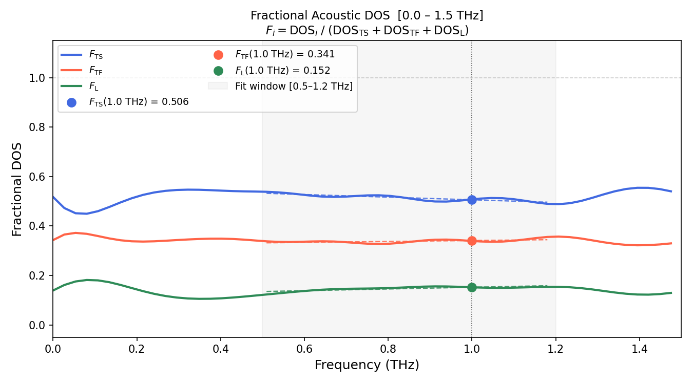
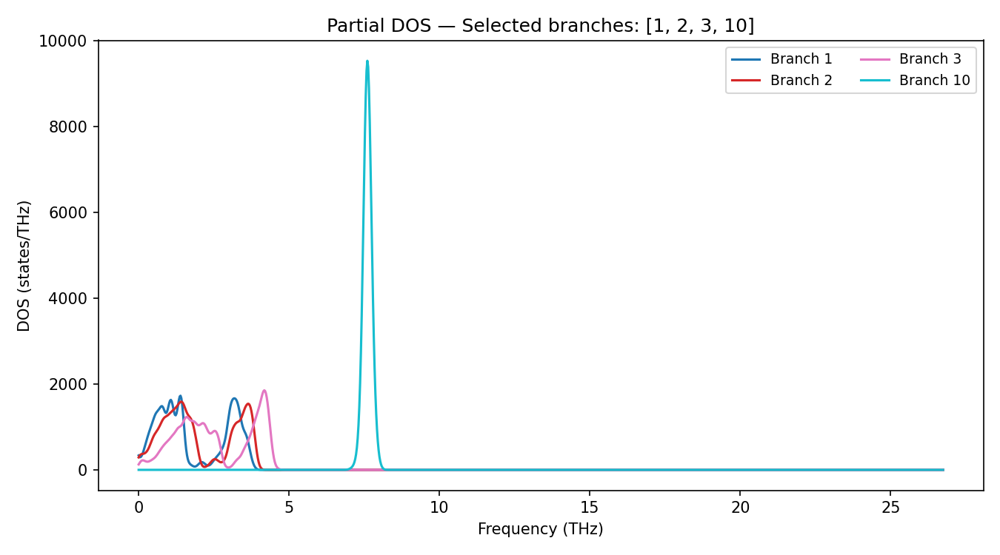

# phonon-fdos

**Generalized Phonon Density of States calculator with Fractional Acoustic DOS analysis**

A Python tool built on top of [Phonopy](https://phonopy.github.io/phonopy/) that computes the phonon Density of States (DOS) and the **Fractional Acoustic DOS** for any material directly from *ab-initio* force constants — no intermediate `qpoints.yaml` file required.

Key features:
- Works with **any material** — branches and q-points are auto-detected
- Supports two input formats: `phonopy_params.yaml.xz` or `FORCE_SETS + POSCAR`
- **Adaptive q-point mesh** that densifies sampling near Γ for accurate low-frequency behavior
- Fractional DOS computation: $F_i(\omega) = \text{DOS}_i / (\text{DOS}_\text{TS} + \text{DOS}_\text{TF} + \text{DOS}_\text{L})$
- **Linear fit** of the fractional DOS in a user-defined window, evaluated at a chosen frequency (default 1 THz)
- Selective branch plotting

---

## Requirements

```
python >= 3.9
phonopy >= 2.20   (tested on 2.38)
numpy
matplotlib
pyyaml
```

Install dependencies:

```bash
pip install phonopy numpy matplotlib pyyaml
# or
conda install -c conda-forge phonopy numpy matplotlib pyyaml
```

---

## Quick start

### From `phonopy_params.yaml.xz` (recommended)

```bash
# Standard uniform mesh
python phonon_dos.py --params phonopy_params.yaml.xz --mesh 21 21 21 --plot

# Adaptive mesh + fractional DOS + linear fit (best for low-frequency analysis)
python phonon_dos.py --params phonopy_params.yaml.xz \
    --adaptive \
    --fdos --acoustic 1 2 3 --fmax-fdos 1.5 \
    --fit --fit-fmin 0.5 --fit-fmax 1.2 --eval-freq 1.0 \
    --plot
```

### From `FORCE_SETS + POSCAR` (+ optional `BORN` for NAC)

```bash
python phonon_dos.py --forces FORCE_SETS --poscar POSCAR --born BORN \
    --adaptive --fdos --acoustic 1 2 3 --fit --plot
```

---

## Example dataset

The example below uses the LiNbO₃ phonon dataset from the
[NIMS Materials Data Repository](https://mdr.nims.go.jp/datasets/f82f6396-331f-4bd1-a790-1230eb07bac5)
(Ab-initio phonon calculation for LiNbO₃ / R3c (161), by Atsushi Togo).

Download `phonopy_params.yaml.xz` from the link above, then run:

```bash
python phonon_dos.py --params phonopy_params.yaml.xz \
    --adaptive --coarse-mesh 50 50 50 --gamma-points 3000 \
    --fdos --acoustic 1 2 3 --fmin-fdos 0.0 --fmax-fdos 1.5 \
    --fit --fit-fmin 0.5 --fit-fmax 1.2 --eval-freq 1.0 \
    --branches 1 2 3 \
    --plot
```

---

The output from the previous command is:



---

## All command-line options

### Input (one required)

| Option | Description |
|--------|-------------|
| `--params FILE` | `phonopy_params.yaml` or `phonopy_params.yaml.xz` — loads structure and force constants in one file. **Recommended.** |
| `--forces FILE` | `FORCE_SETS` file. Must be combined with `--poscar`. |
| `--poscar FILE` | `POSCAR` file with the unit cell structure. Used with `--forces`. Default: `POSCAR` |
| `--born FILE` | `BORN` file with Born effective charges and dielectric tensor for NAC correction (optional, used with `--forces`). |

---

### Q-point sampling (one required)

| Option | Description |
|--------|-------------|
| `--mesh NX NY NZ` | Uniform Monkhorst-Pack mesh, e.g. `--mesh 21 21 21`. Standard approach for the full DOS. |
| `--adaptive` | **Adaptive mesh**: uniform coarse grid + dense logarithmic shells around Γ. Strongly recommended when computing the fractional DOS at low frequencies (0–1.5 THz). See [Why adaptive?](#why-adaptive) below. |

#### Adaptive mesh tuning

| Option | Default | Description |
|--------|---------|-------------|
| `--coarse-mesh NX NY NZ` | `11 11 11` | The background uniform grid used as the base of the adaptive mesh. |
| `--gamma-radius R` | `0.15` | Radius of the dense Γ-centered sphere in fractional reciprocal lattice units (r.l.u.). Increase for materials with very steep acoustic branches. |
| `--gamma-points N` | `2000` | Total number of extra q-points placed inside the Γ-sphere. More points → smoother low-frequency DOS. |
| `--gamma-shells N` | `30` | Number of logarithmic radial shells within the Γ-sphere. The shell point density scales as r², matching the acoustic DOS phase space. |

---

### DOS core options

| Option | Default | Description |
|--------|---------|-------------|
| `--sigma S` | `0.1` | Gaussian smearing width in THz. Smaller values give sharper features; too small leads to noise. |
| `--nfreq N` | `1000` | Number of frequency grid points between `fmin` and `fmax`. |
| `--fmin F` | auto | Minimum frequency of the DOS grid [THz]. Defaults to `max(0, freq_min - sigma)`. |
| `--fmax F` | auto | Maximum frequency of the DOS grid [THz]. Defaults to `freq_max + sigma`. |
| `--smearing TYPE` | `gaussian` | Smearing function: `gaussian` (recommended) or `heaviside` (histogram-like). |

---

### Fractional acoustic DOS

The fractional DOS decomposes the total acoustic contribution into the three acoustic modes: transverse slow (TS), transverse fast (TF), and longitudinal (L):

$$F_i(\omega) = \frac{\text{DOS}_i(\omega)}{\text{DOS}_\text{TS}(\omega) + \text{DOS}_\text{TF}(\omega) + \text{DOS}_\text{L}(\omega)}$$

By construction $F_\text{TS} + F_\text{TF} + F_\text{L} = 1$ at every frequency point.

| Option | Default | Description |
|--------|---------|-------------|
| `--fdos` | off | Enable fractional DOS computation and output. |
| `--acoustic TS TF L` | `1 2 3` | **1-based** branch numbers for the TS, TF, and L acoustic modes respectively. Check your material's band structure to identify which branches are which. |
| `--fmin-fdos F` | `0.0` | Lower frequency bound for the fractional DOS window [THz]. |
| `--fmax-fdos F` | `1.5` | Upper frequency bound for the fractional DOS window [THz]. |
| `--output-fdos FILE` | `FDOS_acoustic.txt` | Output file for fractional DOS (tab-separated). Columns: `Frequency`, `DOS_TS(raw)`, `DOS_TF(raw)`, `DOS_L(raw)`, `FDOS_TS`, `FDOS_TF`, `FDOS_L`. |

---

### Linear fit of fractional DOS

Fits each $F_i(\omega)$ to a linear model $F_i(\omega) = a\,\omega + b$ over a chosen frequency window and evaluates the fit at a target frequency. This extracts a single representative value per branch that is robust against local noise.

| Option | Default | Description |
|--------|---------|-------------|
| `--fit` | off | Enable linear fit. Requires `--fdos`. |
| `--fit-fmin F` | `0.5` | Lower bound of the linear fit window [THz]. |
| `--fit-fmax F` | `1.2` | Upper bound of the linear fit window [THz]. |
| `--eval-freq F` | `1.0` | Frequency at which the fit is evaluated [THz]. |
| `--output-fit FILE` | `FDOS_fit.txt` | Output file with fit slope, intercept, evaluated value, and R² for each branch. |

The fit window should be chosen inside the `--fdos` range and in a region where the fractional DOS is approximately linear. The range `[0.5, 1.2]` THz works well for many oxide materials with acoustic cutoffs around 2–4 THz.

---

### Inspect branches with `--info`

Before running the full DOS, use `--info` to quickly inspect the structure and see all branch numbers — no mesh or DOS computation needed:

```bash
python phonon_dos.py --params phonopy_params.yaml.xz --info
```

Example output (LiNbO₃):

```
===========================================================
  STRUCTURE & BRANCH INFO
===========================================================
  Crystal system   : TRIGONAL
  Atoms in unit cell: 10
  Lattice parameters:
    a = 5.1483 Å    alpha = 90.00°
    b = 5.1483 Å    beta  = 90.00°
    c = 13.8631 Å   gamma = 120.00°

  Total branches   : 30  (= 3 x 10 atoms)
  Acoustic branches: 3
  Optical branches : 27

  Frequency range  : [-0.1234, 18.4521] THz
  (from quick 4x4x4 mesh — run full DOS for accurate values)

   Branch    Min freq (THz)    Max freq (THz)
  --------  ----------------  ----------------
         1          -0.1234            1.2300  ← acoustic
         2          -0.0812            1.8100  ← acoustic
         3           0.0000            2.1400  ← acoustic
         4           1.2300           10.4500
       ...
===========================================================
```

| Option | Description |
|--------|-------------|
| `--info` | Print structure and branch summary then exit. No `--mesh` or `--adaptive` needed. |

---

### Selective branch plotting

Once you know your branch numbers from `--info`, plot any subset:

```bash
# Plot the 3 acoustic branches
python phonon_dos.py --params phonopy_params.yaml.xz     --adaptive --branches 1 2 3 --plot

# Plot acoustic + a specific optical branch
python phonon_dos.py --params phonopy_params.yaml.xz     --adaptive --branches 1 2 3 10 --plot
```
This is the plot with the previois command

| Option | Description |
|--------|-------------|
| `--branches N [N ...]` | Plot the DOS of specific branches only (1-based). E.g. `--branches 1 2 3 10`. Requires `--plot`. |

---

### Output and plotting

| Option | Default | Description |
|--------|---------|-------------|
| `--output FILE` | `DOS_output.txt` | Full DOS output file (tab-separated). Columns: `Frequency`, `Total_DOS`, `Branch_1` ... `Branch_N`. |
| `--plot` | off | Display all plots interactively and save them as PNG files. |
| `--pdos` | off | Overlay all partial branch DOS on the total DOS plot. Can be cluttered for many branches; use `--branches` for a cleaner view. |
| `--save-qpts FILE` | off | Save the generated q-point set to a text file (fractional coordinates). Useful for inspecting the adaptive mesh distribution. |

---

## Output files

| File | Contents |
|------|----------|
| `DOS_output.txt` | Full DOS: frequency grid, total DOS, and one column per branch |
| `FDOS_acoustic.txt` | Fractional DOS: raw acoustic DOS + fractional values per mode |
| `FDOS_fit.txt` | Linear fit results: slope, intercept, value at `eval_freq`, R² |
| `dos.png` | Total (and optionally partial) DOS plot |
| `fractional_dos.png` | Fractional acoustic DOS plot with optional fit overlay |
| `dispersion.png` | Phonon frequencies vs q-point index |
| `dos_selected_branches.png` | Partial DOS for user-selected branches |

---

## Why adaptive? <a name="why-adaptive"></a>

At low frequencies, acoustic phonon branches obey the linear dispersion relation $\omega \approx v_s |\mathbf{q}|$, which means the acoustic DOS scales as $g(\omega) \propto \omega^2$. The fractional DOS $F_i(\omega)$ should be approximately constant (flat) in this regime, since each acoustic mode contributes a fixed fraction of the total phase space.

A uniform Monkhorst-Pack mesh allocates q-points evenly across the Brillouin zone. Because the volume of a shell at radius $|\mathbf{q}|$ scales as $|\mathbf{q}|^2$, a uniform mesh has very few points near $\Gamma$ and therefore poor statistical sampling of the low-frequency acoustic region. This causes the fractional DOS to appear noisy or non-flat at low frequencies.

The adaptive mesh addresses this by replacing all uniform-mesh q-points inside a sphere of radius `--gamma-radius` around $\Gamma$ with a set of logarithmically-spaced shells. This concentrates sampling where it matters most for the low-frequency fractional DOS.

---

## Crystal system auto-detection

The program reads the lattice vectors from your input file and classifies the crystal system (cubic, tetragonal, hexagonal, trigonal, orthorhombic, monoclinic, or triclinic) based on lattice parameter ratios and angles. This classification is used to scale the Γ-sphere into an ellipsoid aligned with the reciprocal lattice, ensuring the dense sampling region is physically appropriate for non-cubic materials.

---

## Citation

If you use this tool in your research, please also cite Phonopy:

> A. Togo, L. Chaput, T. Tadano, I. Tanaka, *J. Phys.: Condens. Matter* **35**, 353001 (2023).  
> https://doi.org/10.1088/1361-648X/acd831

---

## License

MIT License. See `LICENSE` for details.
